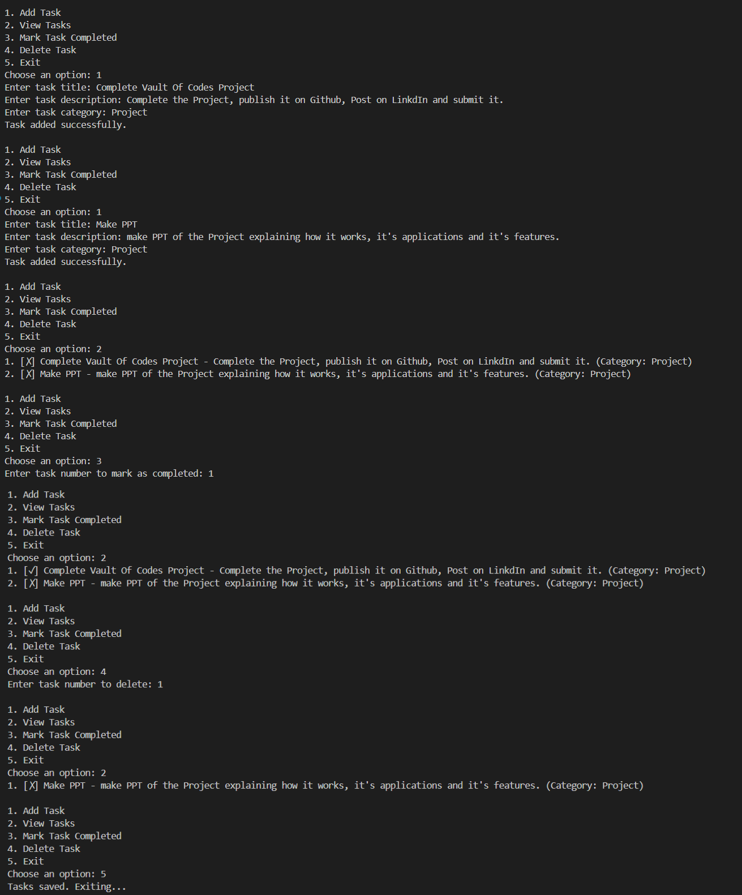

# Python To-Do List Application 

🎉 Welcome to my Python To-Do List Application ! This project was developed during my 1-month internship at [Vault of Codes](https://www.vaultofcodes.in/).

## Overview

This is a CLI-based Python application that helps users manage their tasks effectively by adding, viewing, completing, and deleting them. It’s designed to keep track of your to-do list without the stress!

## Features

- **Add Tasks:** Create new tasks with titles, descriptions, and categories.
- **View Tasks:** See all your tasks along with their completion status.
- **Complete Tasks:** Mark tasks as completed with a single click.
- **Delete Tasks:** Remove tasks you no longer need.
- **Data Persistence:** Saves tasks to a JSON file for easy access.

## Installation

1. Clone the repository:
   ```bash
   git clone https://github.com/Nishant2009/todo_app/
   ```

2. Navigate to the project directory:
    ```bash
    cd todo_app
    ```

3. Run the application:
    ```bash
    python todo.py
    ```

## Screenshots
Here’s what the application looks like in action:



## Usage
Once you run the application, follow the on-screen prompts to manage your tasks. It's simple and straightforward!

Here’s a quick rundown of the commands you can use:

- **Add Task:** Enter `1` to add a new task.
- **View Tasks:** Enter `2` to view all tasks.
- **Complete Task:** Enter `3` to mark a task as completed.
- **Delete Task:** Enter `4` to delete a task.
- **Exit:** Enter `5` to exit the application.

That’s it! You’re all set to manage your tasks like a pro. 🚀

## Challenges Faced

While this project was simple, I did encounter a fun challenge: a JSON decode error when trying to load tasks from an empty file. It was like finding a treasure chest with nothing inside! 😅

To tackle this, I employed a classic `try` and `except` block. Now, if the file’s empty, the program gracefully handles it instead of throwing a tantrum. Every little hiccup taught me something new, and I enjoyed the journey of turning potential pitfalls into learning moments!


## Feedback
I’d love your feedback! Feel free to reach out or leave a comment on the GitHub repository.
